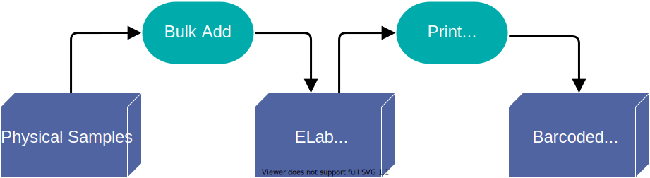
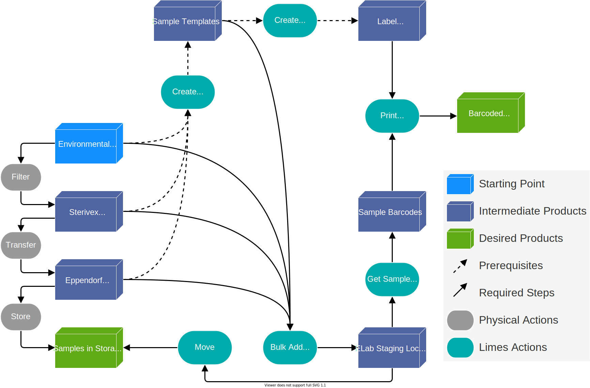

.. |disclaimer| replace:: *The following is focused on the steps related to Limes and may not cover the experimental procedures in sufficient detail.*

.. _ex-title:

Example Use Cases
=================

.. _ex-top:

.. contents::
    :local:

-------------------------------

.. _ex-env:

Processing Environmental Samples
--------------------------------

:ref:`From the Overview<over-diagram>`
""""""""""""""""""""""""""""""""""""""

-------------------------------

Detailed Breakdown
""""""""""""""""""

-------------------------------

Prerequisites
"""""""""""""
#. A `sample type <https://www.elabjournal.com/doc/AddingSampleTypes.html>`_ must exist in eLab for each type of sample encountered.

    A ``type`` refers to a set of unique descriptors. For example,
    all Saanich Inlet samples require *location, depth and date of collection*, while all
    fosmid pools may require details on the *source sample, screening outcomes or gene content
    information*. Since fosmid pools and Saanich Inlet samples each require a different set of descriptors
    from each other, they are of different types.

#. A `label template <https://elab.msl.ubc.ca/members/protocol/?protID=40950>`_ must exist for each style of label to be printed.

Steps
""""""
1. **Review the prerequisites above and ensure they are satisfied.**
2. `Record environmental samples <https://elab.msl.ubc.ca/members/protocol/?protID=40960>`_ in an eLab `staging area <https://elab.msl.ubc.ca/members/inventory/browser/?initStorageLayer=784024>`_
3. :ref:`Get the barcodes of the newly created sample entries<port-searchLoc>` from step 2.
4. :ref:`Print labels for the orginal samples by using their barcodes.<port-labels>`. Label the orginal samples.
5. Filter water sample(s) through Sterivex filters [`small volume <https://www.jove.com/v/1163/small-volume-1-3l-filtration-of-coastal-seawater-samples>`_, `large volume <https://www.jove.com/v/1161/large-volume-20l-filtration-of-coastal-seawater-samples>`_]
6. `Record filters <https://elab.msl.ubc.ca/members/protocol/?protID=40960>`_ in an eLab `staging area <https://elab.msl.ubc.ca/members/inventory/browser/?initStorageLayer=784024>`_. Specify each filter's parent to be the respective sample from step 2.
7. :ref:`Get the barcodes of the newly created filter entries<port-searchLoc>` from step 6.
8. :ref:`Print labels for the Sterivex filters <port-labels>`. Label the filters.
9. `Move all samples digitally <https://www.elabjournal.com/doc/MovingSamples.html>`_ from the staging area to their final locations
10. Transfer all samples physically to their final storage locations.

:ref:`Back to top<ex-top>`

------------------------------------

Linking Sequencing Data to Physical Samples
-----------------------------------------------

*Coming soon*

:ref:`Back to top<ex-top>`

------------------------------------

Adding Samples with Existing Barcodes
-----------------------------------------------

*Coming soon*

:ref:`Back to top<ex-top>`