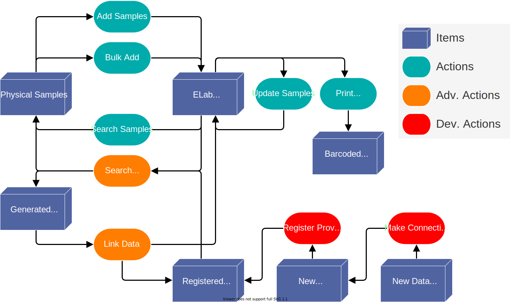

.. _over-title:

Possible User Actions
=====================

.. _over-diagram:

Workflows Diagram
-----------------

**Diagram elements:**

* **Items** represent starting conditions, desired outcomes, or required intermediates.
* **Actions** show the steps necessary to obtain indicated items. 
  
  * **Standard** actions can be performed through the :ref:`portal<port-title>` with no installations.
  * **Advanced** actions require the use of the :ref:`python client<py-title>`.
  * **Development** actions require changes to the :ref:`code base<contr-title>`.

The above shows the possible high-level actions for working with LIMS data, what each
action achieves, and how to chain actions together. For example, to get *barcoded labels*
from from *physical samples*, the action *Add Samples* must first be done to get
*ELab Records*, followed by the action *Print Labels*.

:ref:`ex-title`

------------------------------------

.. _over-list:

List of Actions
---------------

Standard Actions
""""""""""""""""

- `Adding Samples <https://www.elabjournal.com/doc/AddingSamples.html>`_
- `Bulk Add Samples <https://elab.msl.ubc.ca/members/protocol/?protID=40960>`_
- `Update Samples <https://www.elabjournal.com/doc/UpdatingSamples.html>`_
- `Printing Labels <https://elab.msl.ubc.ca/members/protocol/?protID=40951>`_
- `Search Samples <https://www.elabjournal.com/doc/SearchingSamples.html>`_

.. Tip::
    View eLab's `full documentation here <https://www.elabjournal.com/doc/>`_

:ref:`Advanced Actions with Python<py-title>`
""""""""""""""""""""""""""""""""""""""""""""""

:ref:`Developer Actions<contr-title>`
"""""""""""""""""""""""""""""""""""""